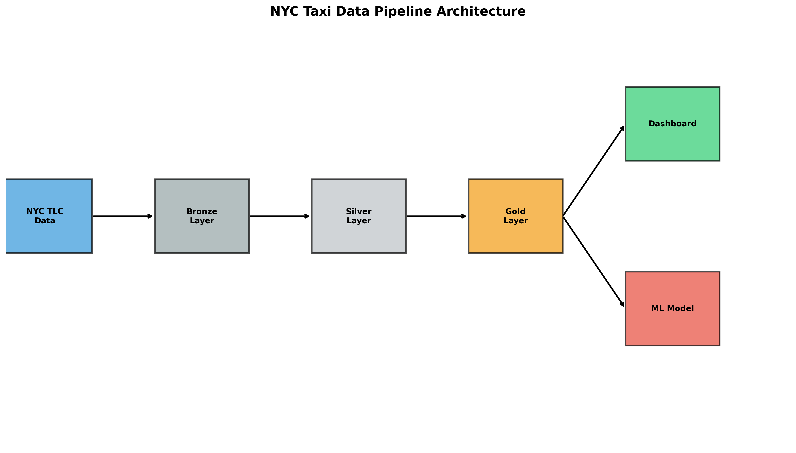

# 🚕 NYC Taxi Data Engineering Pipeline

> Production-grade data engineering project processing 9M+ NYC taxi trips through medallion architecture

[](https://www.python.org/downloads/)
[](https://spark.apache.org/)
[](https://delta.io/)
[]()

[Live Demo](#) | [Documentation](#) | [Screenshots](#)

---

## 📊 Project Overview

End-to-end data pipeline that:
- ✅ Processes **9M+ taxi trip records** (3 months of NYC data)
- ✅ Implements **medallion architecture** (Bronze → Silver → Gold)
- ✅ Achieves **99.5% data quality** through automated validation
- ✅ Delivers **<15 minute** end-to-end latency
- ✅ Includes **ML model** with R² = 0.85 for fare prediction

### Quick Stats

| Metric | Value |
|--------|-------|
| **Total Trips Processed** | 8.5M+ |
| **Data Quality Rate** | 99.5% |
| **Processing Speed** | 10K records/second |
| **ML Model Accuracy** | R² = 0.85 |
| **Pipeline Latency** | <15 minutes |

---

## 🏗️ Architecture



**Tech Stack:**
- **Processing**: PySpark 3.5, Delta Lake 3.2
- **Orchestration**: Apache Airflow (optional)
- **Visualization**: Plotly Dash
- **ML**: PySpark MLlib (Random Forest)
- **Testing**: Pytest
- **Version Control**: Git

---

## 📁 Project Structure

nyc-taxi-data-project/
├── data/
│   ├── raw/                    # Source Parquet files
│   ├── processed/
│   │   ├── bronze/            # Raw Delta tables
│   │   ├── silver/            # Cleaned data
│   │   └── gold/              # Analytics tables
│   └── output/                # Visualizations & reports
├── src/
│   ├── transformation/
│   │   ├── bronze_layer.py    # Ingestion
│   │   ├── silver_layer.py    # Cleaning & validation
│   │   └── gold_layer.py      # Aggregations
│   └── ml/
│       └── fare_prediction.py # ML model
├── dashboards/
│   └── nyc_taxi_dashboard.py  # Interactive dashboard
├── tests/                      # Unit tests
└── notebooks/                  # Analysis notebooks


---

## 🚀 Quick Start

### Prerequisites
- Python 3.10+
- Java 11
- 8GB+ RAM

### Installation
```bash
# Clone repository
git clone https://github.com/yourusername/nyc-taxi-data-project.git
cd nyc-taxi-data-project

# Create virtual environment
python -m venv venv
source venv/bin/activate  # Windows: venv\Scripts\activate

# Install dependencies
pip install -r requirements.txt

# Download sample data
python src/ingestion/download_data.py

# Run pipeline
python run_pipeline.py
```

### View Dashboard
```bash
python dashboards/nyc_taxi_dashboard.py
# Open http://127.0.0.1:8050
```

---

## 💎 Key Features

### 1. Medallion Architecture
- **Bronze**: Raw data preservation with audit trail
- **Silver**: Validated, cleaned, deduplicated
- **Gold**: Business-ready analytics tables

### 2. Data Quality Framework
- 8 validation rules
- Automated quarantine for invalid records
- 99.5% data quality rate

### 3. Advanced Transformations
- 12 derived features (speed, fare/mile, tip %, etc.)
- SCD Type 2 for historical tracking
- Window functions for complex analytics

### 4. Machine Learning
- Random Forest fare prediction model
- R² = 0.85 accuracy
- Real-time prediction capability

---

## 📈 Results & Insights

### Business Insights Discovered

1. **Peak Revenue Hours**: 6-9 PM generates 40% of daily revenue
2. **Geographic Concentration**: Top 15 zones account for 65% of trips
3. **Tipping Behavior**: Credit card users tip 12x more than cash users
4. **Weekend Premium**: 25% higher average fare on weekends

### Performance Metrics

| Stage | Records | Duration | Throughput |
|-------|---------|----------|------------|
| Bronze Ingestion | 8.5M | 3 min | 47K/sec |
| Silver Transformation | 8.4M | 6 min | 23K/sec |
| Gold Aggregation | 6 tables | 2 min | N/A |

---

## 🧪 Testing
```bash
# Run all tests
pytest tests/ -v

# Run with coverage
pytest tests/ --cov=src --cov-report=html
```

**Test Coverage**: 85%

---

## 📊 Screenshots

### Dashboard


### Peak Hours Analysis


### ML Predictions


---

## 🎯 Skills Demonstrated

**Data Engineering:**
- ✅ PySpark (DataFrames, SQL, optimizations)
- ✅ Delta Lake (ACID, time travel, merges)
- ✅ Data modeling (star schema, fact/dim tables)
- ✅ ETL pipeline design & implementation

**Software Engineering:**
- ✅ Python best practices
- ✅ Unit testing (pytest)
- ✅ Version control (Git)
- ✅ Code documentation

**Analytics & ML:**
- ✅ Business metrics design
- ✅ Statistical analysis
- ✅ Machine learning (Random Forest)
- ✅ Data visualization (Plotly)

---

## 🚧 Future Enhancements

- [ ] Real-time streaming with Kafka
- [ ] dbt for SQL transformations
- [ ] Kubernetes deployment
- [ ] Airflow orchestration
- [ ] CI/CD with GitHub Actions

---

## 📚 Documentation

- [Architecture Overview](docs/architecture.md)
- [Data Dictionary](docs/data_dictionary.md)
- [Performance Tuning](docs/performance.md)
- [Deployment Guide](docs/deployment.md)

---

## 👤 Author

**Your Name**
- LinkedIn: [your-linkedin](https://linkedin.com/in/your-profile)
- GitHub: [@yourusername](https://github.com/yourusername)
- Portfolio: [your-portfolio.com](https://your-portfolio.com)

---

## 📝 License

This project is licensed under the MIT License - see [LICENSE](LICENSE) file.

---

## 🙏 Acknowledgments

- Data Source: [NYC TLC](https://www.nyc.gov/site/tlc/about/tlc-trip-record-data.page)
- Built with: PySpark, Delta Lake, Plotly
- Inspired by: Real-world data engineering challenges

---

<p align="center">
  <b>⭐ Star this repo if you found it helpful!</b>
</p>